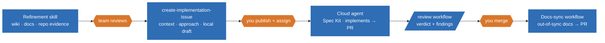

# From Prompting to Agentic Engineering

How we ship with agents at Shop 6 — and how it can speed up your tasks

  Laptop optional
  Bring a real task

  
🤖 agent

  
you decide → next task

Shop 6 · Tue 29 Sept · CodeLeap office

<!--
How Shop 6 works today, not a vendor demo. 60 minutes, one focused hands-on comparison, laptop optional. Keep a real task in mind for the end.
-->

---
layout: center
---

Not 'AI or no AI?'

# Who owns the context — and the feedback loop?

  

    
Context

    
ticket, repos, wiki, rules, history

  

  

    
Feedback loop

    
who checks the result, who decides next

  

<!--
Everyone already uses AI somewhere. The question is who holds the context and who closes the loop. In prompting you do both; in agentic engineering you hand parts over, on purpose, with boundaries.
-->

---

  
QUICK PULSE · 2 MINUTES

  <h1 class="text-center text-5xl font-bold">What do you think AI can handle in our work today?</h1>
  
Which tasks would you trust it with — and where would you still step in?

<!--
Take a quick show of hands, then invite two short answers: which tasks would people delegate today, and where would they still step in? Keep it open and non-judgmental. Return to the question after the same-task comparison.
-->

---

# Shop 6 today: an agentic pipeline

One ticket. Several repos. Agents do the legwork, people decide.

<!--
A skill refines the ticket using cross-repo knowledge (wiki, docs); the team reviews it. create-implementation-issue gathers context, finds the approach and saves a local issue draft. A person publishes the GitHub issue and assigns it to the cloud agent. On the PR, /review gives a verdict — approve or reject, with findings by severity and suggestions. A person merges. After merge, a workflow finds out-of-sync docs and opens a PR. Agents run most steps; people own the gates.
-->

---

# Both start with a prompt. The loop is different.

  

    
Prompt-driven

    

      You→Prompt→Answer→You→Prompt → Answer →You …
    

  

  

    
Agentic

    

      You→Brief + boundaries→Agent: gather · draft · check→Evidence→You decide
    

  

<!--
Prompt-driven, you're the glue between every step. Agentic, you set the workflow and boundaries once; the agent loops and returns evidence. You move from doing steps to deciding at gates.
-->

---

# The agentic approach

Six questions before you delegate

  

    
Who are we?

    
Project, conventions, rules

    
<b>Shop 6:</b> AGENTS.md, wiki, docs

  

  

    
What do we want?

    
The outcome, and what “done” means

    
<b>Shop 6:</b> refined ticket, acceptance criteria

  

  

    
How do I verify it?

    
Tests, evidence, who checks

    
<b>Shop 6:</b> tests, /review verdict, docs-sync

  

  

    
What must it not touch?

    
Scope and boundaries

    
<b>Shop 6:</b> sibling repos read-only, issue scope

  

  

    
When should it stop and ask?

    
Uncertainty, risky areas, repeated failures

    
<b>Shop 6:</b> team review, assign gate, three-failed-fixes rule

  

  

    
What happens if it’s wrong?

    
The blast radius

    
<b>Shop 6:</b> decides in-loop, cloud agent, or a workflow on its own

  

<!--
Before delegating, answer these six questions for the agent: who the project is, what outcome is wanted, how the result will be verified, what is out of scope, when to stop and ask, and what happens if the result is wrong. Shop 6 answers them through repository guidance, refined tickets and acceptance criteria, tests and review, read-only sibling repos, human review and assignment gates, and different execution modes for different blast radii.
-->

---
layout: section
---

  <h1 class="text-6xl font-bold">Before · Prompt-driven</h1>
  
Where most of us started. You drive every step.

<!--
Not Shop 6 today — the baseline we compare against.
-->

---

# Assemble the evidence by hand.

  

    
Jira ticket

    
repo A

    
repo B

    
wiki/docs

    
Slack thread

  

  

→

→

→

→

→

  
You

  
→

  

you
Draft issue

<!--
Tabs, copy, paste. You're the integration layer; the AI helps at each step but you carry everything between steps.
-->

---

# You own every handoff — one issue at a time.

  
you
Read draft

  
you
Publish issue

  
you
Implement

  
you
Review

  
you
Update docs

  

Issue · waiting

Issue · waiting

Issue · waiting

<!--
It works, it's serial, your attention is the queue. Docs are the step that gets skipped when you're tired.
-->

---
layout: section
---

  <h1 class="text-6xl font-bold">Now · Shop 6 agentic pipeline</h1>
  
Two live demos · two Shop 6 team members

  
1 · Create and hand off the task &nbsp; → &nbsp; 2 · Implement end to end

<!--
Session 1: team member 1 refines the request, gathers context, drafts the issue, publishes it, and assigns Copilot. Session 2: team member 2 walks an assigned task through Spec Kit implementation, /review, human merge, docs sync, docs PR review, and the next-issue handoff. Use an approved live task/PR or clearly label any prepared fallback.
-->

---

LIVE DEMO 1 · TEAM MEMBER 1 · CREATE THE TASK

# Refine the ticket with what the whole fleet knows.

  

Jira ticket

Wiki

Docs

Repo evidence

  
→

  

agent
Refinement skill

  
→

  
Refined ticket

  
→

  

you
Team review

<!--
Team member 1 checks the ticket against wiki, docs and repo evidence, then asks the smallest set of questions. This is a proposal; the team reviews it before anything is written back.
-->

---

LIVE DEMO 1 · TEAM MEMBER 1 · CREATE THE TASK

# Gather the context. Find the approach. Hand it over.

  
Refined ticket

→

  

agent

create-implementation-issue

context · approach · local draft

→

  

you
Publish issue + assign

→

agent
Cloud agent · Spec Kit

→

PR

<!--
Team member 1 runs `create-implementation-issue`, reviews the evidence-backed local draft, publishes it as a GitHub issue, and assigns Copilot. After handoff, they move to the next issue while Copilot works. Shop 6 uses Spec Kit for the implementation that follows.
-->

---

LIVE DEMO 2 · TEAM MEMBER 2 · IMPLEMENT END TO END

# /review — a verdict, not a vibe.

  
PR

→

  

agent
/review

→

  

agent

Approve / Reject

Findings by severity · Suggestions

→

  

you
You merge

<!--
Team member 2 picks up an assigned Shop 6 task and shows the Spec Kit implementation, then runs `/review`. The verdict includes findings ranked by severity and concrete suggestions. Approve means ready for a human, never auto-merge. A person reads the evidence and merges.
-->

---

LIVE DEMO 2 · TEAM MEMBER 2 · IMPLEMENT END TO END

# After merge, the docs catch up.

  
Merged PR

→

  

workflow
Docs-sync workflow runs on its own

→

  
Out-of-sync docs found

→

Docs PR

→

  

you
You review

<!--
After the human merge, nobody starts docs sync manually. It checks for docs that no longer match the code and opens a PR; team member 2 reviews that PR, then moves to the next issue.
-->

---

# Better context, fewer tokens.

  

CodeGraph

Callers · callees · impact radius

  

rtk

Less command noise · fewer tokens

  

Wiki &amp; docs

Cross-repo facts for refinement

Also: [other tools we use]

Sample: CodeGraph 181–205 ms (3 warm runs) · RTK <code>git log --stat -n 10</code>: 616 tokens saved (50.2% estimate)

<a class="text-slate-800 underline" href="/downloads/resources.zip" download>Download skills + tool references</a>

<!--
Agents fail on bad context more than bad reasoning; these tools feed them the right context. CodeGraph answers "what calls this, what breaks if I change it" without reading half the repo. Three warm CodeGraph service runs of `JtlSearchAdapter searchProducts callers` took 181–205 ms. The local Shop 6 checkout has no CodeGraph index; the measured query used the existing shared graph. RTK reported 616 estimated tokens saved (50.2%) for `rtk git log --stat -n 10`; that is one command's estimate, not a general saving rate. rtk keeps command output short, so attention goes where it matters and it costs fewer tokens. [our measured saving, if any]
-->

---

FUTURE PLAN · GITHUB AGENTIC WORKFLOWS

# Start the workflow from the ticket.

  

    
Jira assigned to agent

    
OR

    
GitHub issue created

  

  
→

  

workflow
Refine ticket

  
→

  

agent
Spec Kit

  
→

  

agent
Implement

  
→

  

workflow
Code review

  
→

  

you
Merge

  
<b>Spec-driven is our next step:</b> a better harness helps the agent deliver better results.

  
<b>Silly hypothetical:</b> “Make checkout faster.” <b>Agent:</b> removes checkout. Fastest checkout. 😅

<b>Hypothesis to test:</b> a full agentic workflow can outperform a standalone Superpowers skill as tasks grow more complex.

<!--
Future plan: apply GitHub Agentic Workflows so a Jira ticket assigned to an agent or a newly created GitHub issue can trigger refinement, then Spec Kit-guided implementation and code review. A person still owns the merge. We believe spec-driven work is the next step: the better the harness, the better the results. Our hypothesis is that a full end-to-end workflow can outperform a standalone Superpowers skill as tasks grow more complex; measure this in the pilot. Clear instructions help even a capable agent; ambiguity can confuse a smart one too. The checkout line is an intentionally silly hypothetical, not a Shop 6 incident.
-->

---

# Same task. Different control surface.

<table class="mt-5 w-full border-collapse text-center text-xs">
  <thead><tr><th></th><th>Refine</th><th>Issue + context</th><th>Publish + assign</th><th>Implement</th><th>Review</th><th>Docs</th></tr></thead>
  <tbody>
    <tr><th>Before</th><td>you</td><td>you</td><td>you</td><td>you / AI chat</td><td>you</td><td>you (if time)</td></tr>
    <tr><th>Shop 6 now</th><td>agent → team reviews</td><td>agent</td><td>you</td><td>cloud agent</td><td>/review → you merge</td><td>workflow → you review PR</td></tr>
  </tbody>
</table>

<!--
Same steps. Before, you did almost all of them. Now agents do the legwork and people sit at the gates. Accountability didn't move — your name is still on the merge.
-->

---

# Shop 6 agent activity by repository

<table class="mt-5 w-full border-collapse text-center text-sm">
  <thead><tr><th class="p-2 text-left">Repository</th><th>Tasks</th><th>PR-linked</th><th>Sessions</th><th>Completed</th><th>Failed</th><th>Cancelled</th></tr></thead>
  <tbody>
    <tr><th class="p-2 text-left">Shop standards</th><td>21</td><td>21</td><td>47</td><td>20</td><td>0</td><td>1</td></tr>
    <tr><th class="p-2 text-left">Contracts</th><td>121</td><td>121</td><td>171</td><td>114</td><td>4</td><td>3</td></tr>
    <tr><th class="p-2 text-left">Admin</th><td>141</td><td>141</td><td>235</td><td>131</td><td>4</td><td>6</td></tr>
    <tr><th class="p-2 text-left">Storefront</th><td>156</td><td>156</td><td>251</td><td>144</td><td>2</td><td>10</td></tr>
    <tr><th class="p-2 text-left">ERP connector</th><td>157</td><td>151</td><td>181</td><td>152</td><td>0</td><td>5</td></tr>
    <tr><th class="p-2 text-left">Components</th><td>92</td><td>92</td><td>111</td><td>86</td><td>1</td><td>5</td></tr>
    <tr><th class="p-2 text-left">Search</th><td>108</td><td>108</td><td>161</td><td>101</td><td>5</td><td>2</td></tr>
    <tr><th class="p-2 text-left">Infrastructure</th><td>97</td><td>96</td><td>206</td><td>93</td><td>2</td><td>2</td></tr>
    <tr><th class="p-2 text-left">Local</th><td>0</td><td>0</td><td>0</td><td>0</td><td>0</td><td>0</td></tr>
    <tr><th class="p-2 text-left">Frontend proxy</th><td>0</td><td>0</td><td>0</td><td>0</td><td>0</td><td>0</td></tr>
    <tr class="border-t-2 font-bold"><th class="p-2 text-left">Total</th><td>893</td><td>886</td><td>1,363</td><td>841</td><td>18</td><td>34</td></tr>
  </tbody>
</table>

<!--
These are the supplied Shop 6 repository totals: tasks, tasks linked to PRs, agent sessions, and task outcomes. Keep the table factual; it describes activity and outcomes, not a controlled comparison with the prompt-driven run.
-->

---

# Agent session elapsed time

76 sessions with recorded start and end times

<table class="mt-7 w-full border-collapse text-center text-lg">
  <thead><tr><th class="p-3 text-left">Repository</th><th>Sessions</th><th>Mean</th><th>Median</th><th>90th percentile</th></tr></thead>
  <tbody>
    <tr><th class="p-3 text-left">Shop standards</th><td>29</td><td>6.5 min</td><td>4.9 min</td><td>12.0 min</td></tr>
    <tr><th class="p-3 text-left">Contracts</th><td>13</td><td>7.6 min</td><td>8.3 min</td><td>10.9 min</td></tr>
    <tr><th class="p-3 text-left">Admin</th><td>20</td><td>25.8 min</td><td>20.0 min</td><td>56.7 min</td></tr>
    <tr><th class="p-3 text-left">Storefront</th><td>14</td><td>8.5 min</td><td>8.4 min</td><td>12.5 min</td></tr>
    <tr class="border-t-2 font-bold"><th class="p-3 text-left">Sample total</th><td>76</td><td>12.1 min</td><td>8.3 min</td><td>20.5 min</td></tr>
  </tbody>
</table>

<!--
These elapsed-time figures cover only sessions with both a start and end time in the supplied sample. They are session elapsed times, not hands-on time or a matched before/after task benchmark.
-->

---

# Pros & trade-offs: discuss what matters in your repo.

  

    
Pros

    <ul class="space-y-4 text-lg">
      <li>Shared context across repos goes into the issue draft.</li>
      <li>After handoff, you can start the next ticket.</li>
    </ul>
  

  

    
Trade-offs

    <ul class="space-y-3 text-lg">
      <li>Refinement and issue drafting still start by hand.</li>
      <li>Docs catch up after merge; main is briefly stale.</li>
      <li>Activity metrics are not a matched before/after speed benchmark.</li>
    </ul>
  

<!--
Discuss: which benefit would matter most in your repo, and which trade-off would you address first? Activity and elapsed-session metrics are available; a matched before/after task benchmark is a separate measurement.
-->

---

  
TRY · 14 minutes · laptop optional

  <h1 class="text-4xl font-bold">Run the same task two ways.</h1>
  

    

      
Prompt-only · manual loop

      
Gather the same cross-repo context yourself. Prompt the model step by step to build the issue draft.

    

    

      
Agentic · Shop 6 skill

      
Run <code>create-implementation-issue</code>; it gathers evidence and saves a local issue draft. Follow the full pipeline in the two live demos.

    

  

  

    6 minutes each · 2 minutes to compare time, evidence, and rework
    <a class="rounded-full bg-slate-200 px-4 py-2 font-semibold text-slate-900" href="/downloads/resources.zip" download>Download resources · extract at repo root</a>
  

  
Local draft; a person publishes the GitHub issue. Spec Kit is required for substantial work; cloud-bootstrap can create missing artifacts.

  
No laptop? Follow the demo.

<!--
No pair work. Use the same small task and repo for both runs. Spend six minutes manually gathering context and prompting the model to build the issue draft, then six minutes using `create-implementation-issue`; use the last two minutes to compare elapsed time, evidence captured, and rework. This ends at a local issue draft: the skill does not publish the GitHub issue. Do not use Superpowers as the prompt-only control; it is itself an agentic skill. The two live demos show the full Shop 6 flow, including Spec Kit implementation. Our hypothesis is that the full workflow brings more value as task complexity grows; this short comparison does not prove it.
-->

---
layout: center
---

# Thank you

## What would you hand over first?

Start here: AGENTS.md in any shop repo · Shop 6 onboarding page

<!--
Take questions. If quiet, ask the closing question.
-->
